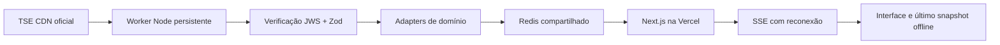

# Eleições 2026 — Resultados oficiais

Dashboard independente em português para acompanhar a divulgação do TSE. Next.js 16.3.8, React 19.3.0, TypeScript estrito, App Router, Tailwind CSS 4, Zod, Vitest e Playwright. Não utiliza APIs eleitorais de terceiros nem dados fictícios em produção.

Conversa pública opcional com apelido, cidade e estado na primeira visita, sessões protegidas, limites contra spam, denúncias e painel privado de moderação. Comentários não participam dos resultados oficiais. Consulte [CHAT.md](docs/CHAT.md) para operação e limites.

**Antes de divulgar resultados, o sistema exige assinatura válida, schema compatível e autorização oficial de divulgação.** Arquivos preparatórios com `and=n` não viram resultados com zero votos. O resultado presidencial também respeita 17h de Brasília na data da eleição configurada.

## Arquitetura

**Perfil gratuito publicado:** [eleicoes-2026-plum.vercel.app](https://eleicoes-2026-plum.vercel.app). Vercel Hobby executa o gateway; Next.js, worker e Redis rodam neste computador, conectados por túnel HTTPS Localtunnel. Não há hospedagem paga ativada. O usuário autorizou manter o computador ligado durante a apuração. Este perfil usa polling interno de 15 s e depende do computador/internet/túnel, sem uptime garantido. Consulte [DEPLOY.md](docs/DEPLOY.md) para limites e reinício.

O diagrama abaixo descreve a alternativa preparada para infraestrutura independente do computador, que continua disponível no código:



O navegador consulta somente a API interna. A API e o SSR leem cache; quem consulta o TSE é o worker com orçamento global de 4 requisições/s. Uma concessão Redis com renovação e escrita protegida impede ingestores simultâneos. Em desenvolvimento, arquivos atômicos substituem Redis; esse modo não serve para Vercel nem alta disponibilidade.

SSE na Vercel tem sessões de 50 segundos, `maxDuration=60`, identificação de revisão, heartbeat e reconexão. Polling interno de 15 segundos mantém atualização quando SSE falha. A ingestão contínua **não** roda em funções serverless. A decisão considera a [duração limitada das funções Vercel](https://vercel.com/docs/functions/limitations), incluindo respostas em streaming. Consulte [ARCHITECTURE.md](docs/ARCHITECTURE.md).

## Fontes oficiais

- [Informações técnicas de divulgação 2026](https://www.tse.jus.br/eleicoes/informacoes-tecnicas-sobre-a-divulgacao-de-resultados)
- [Especificações EA10, EA11, EA12, EA14, EA15, EA16, EA18, EA20, download e JWS](https://www.tse.jus.br/eleicoes/eleicoes-2026-content/arquivos/divulgacao-de-resultados)
- [Configuração oficial EA11](https://resultados.tse.jus.br/oficial/comum/config/ele-c.json)

Na verificação de 04/10/2026, EA11 confirmou pleito 3220, eleição federal 6257, estadual 6259 e Conselho Distrital 6261, ciclo `ele2026`. São observações documentadas, não constantes usadas para construir resultados. O worker redescobre os códigos por data/turno e utiliza os diretórios `arq` oficiais. Consulte os URLs e o mapa de campos em [TSE-DATA.md](docs/TSE-DATA.md).

## Desenvolvimento

Requisito: Node.js 24 ou superior, npm, acesso HTTPS ao TSE. Instalação reproduzível pelo lockfile:

```powershell
npm ci
Copy-Item .env.example .env.local
npm run worker
```

Em outro terminal, no mesmo diretório:

```powershell
npm run dev
```

Abra `http://localhost:3000`. O worker lê `.env.local` e ambos usam `.data/v1`. Sem worker ou configuração, a interface informa indisponibilidade. Nenhuma fixture é carregada automaticamente.

Em Windows, se Node retornar `UNABLE_TO_VERIFY_LEAF_SIGNATURE`, use o repositório de certificados do sistema, mantendo TLS:

```powershell
$env:NODE_OPTIONS='--use-system-ca'
npm run worker
```

Não use `NODE_TLS_REJECT_UNAUTHORIZED=0`. Em Linux, instale a cadeia de confiança adequada no sistema operacional.

## Variáveis

| Variável                  | Uso / padrão                                                                  |
| ------------------------- | ----------------------------------------------------------------------------- |
| `REDIS_URL`               | Redis TCP compartilhado, preferencialmente `rediss://`, obrigatório na Vercel |
| `CACHE_DIR`               | `.data`, somente desenvolvimento local                                        |
| `TSE_ELECTION_DATE`       | `04/10/2026`, seletor da configuração oficial                                 |
| `TSE_TURN`                | `1`, seletor do turno                                                         |
| `TSE_REQUESTS_PER_SECOND` | `4`; aceito de 1 a 5, não elevar para o limite do TSE                         |
| `TSE_TIMEOUT_MS`          | `8000`                                                                        |
| `TSE_MAX_BYTES`           | `20971520`, limite antes e durante leitura                                    |
| `SITE_URL`                | URL pública HTTPS para metadata, sitemap e OpenGraph                          |
| `NODE_OPTIONS`            | Opcional `--use-system-ca` no ambiente que precisar da confiança do sistema   |

Não há variável pública de credencial, endpoint eleitoral arbitrário ou modo de resultados simulados. Não publique `.env.local`.

## Testes e verificações

```powershell
npm run lint
npm run typecheck
npm run test
npm run check:sources
npm run build
npx playwright install chromium
npm run test:e2e
npm audit --omit=dev
```

Playwright inicia a produção na porta 3100 com cache isolado `.data-e2e/v1`, alimentado apenas pelas capturas oficiais preparatórias. Transições sintéticas necessárias para exercitar apuração e falhas ficam exclusivamente nos testes de browser, via interceptação da API interna. Elas nunca entram no cache normal. A suíte cobre desktop e emulação de iPhone em Chromium; não substitui teste físico Safari/iOS.

As fixtures preservadas em `docs/sources` incluem JSONs oficiais e JWS reais. `check:sources` verifica isolamento, valida schemas e assinaturas e gera um inventário de hashes/URLs. A verificação estática é evidência limitada; revise também `src/lib/tse/client.ts`, `urls.ts` e tráfego de rede do worker.

## Atualização, cache e falhas

Brasil/Exterior e EA14: base de 2 segundos, aumentando até 30 segundos sem alterações. EA15 de abrangências demandadas: mínimo 10 segundos. UFs presidenciais: EA14 antecipa alterações; fallback EA20 a cada 60 segundos. Municípios e demais cargos são ativados por demanda validada. EA11/EA12 são revalidados em 5 minutos; EA16 do Exterior em 1 hora. O orçamento global e a fila podem aumentar o intervalo real.

ETag e Last-Modified geram requisições condicionais; 304 conserva o snapshot. Hash SHA-256 do conteúdo validado controla emissão de atualizações. `current` e `previous` guardam URL, geração, recebimento, ETag, Last-Modified, hash e validação. Não se calcula percentual, líder matemático nem vencedor; diferenças são explicitamente derivadas de valores oficiais.

404: mínimo 5 minutos, com jitter. 429: pausa global mínima de 10 minutos, respeitando Retry-After. Timeout/5xx/JSON inválido/schema incompatível/assinatura inválida: backoff exponencial, último snapshot válido preservado e aviso visível. O TSE informa limite de **100 requests/s/IP**, incluindo 304, e possíveis bloqueios por insistência em 404 ou durante bloqueio. Consulte [RELIABILITY.md](docs/RELIABILITY.md).

`/api/health` publica status, último sucesso, última geração TSE, hash, situação da fonte e do polling. Heartbeat sem atualização por 45 segundos gera degradação/HTTP 503. Logs JSON ficam no servidor e não expõem credenciais.

## Exterior

`TSEExteriorAdapter` identifica o Exterior pelo nome descritivo EA12, confirma o código na configuração e valida os resultados recebidos. O código observado em 2026 é `zz`; não é presumido como abrangência válida sem configuração. EA20 oferece consolidado e localidades; EA16 oferece zonas e seções. A comparação sempre usa o consolidado do Exterior, inclusive quando uma localidade está selecionada.

Não foi encontrado relacionamento oficial de localidade com país nos arquivos consumidos. Portanto, não há agregação nem tabela de países. **Brasil inclui o Exterior**, conforme EA20; a comparação não subtrai votos. Detalhes e evidências em [EXTERIOR.md](docs/EXTERIOR.md).

## Deploy

A implantação gratuita efetiva e seus comandos de reinício estão em [DEPLOY.md](docs/DEPLOY.md). `deploy/free-gateway` contém o projeto Vercel publicado. O `vercel.json` na raiz prepara a alternativa Next.js integral na Vercel, que exige cache compartilhado externo e não é o perfil gratuito atual. Nenhum recurso Render pago foi criado.

1. Provisionar Redis persistente com TLS, backups, espaço suficiente e política `noeviction`. É necessária interface Redis TCP; um endpoint somente REST não funciona com este driver.
2. Subir o worker em Node.js persistente (container, VM ou serviço equivalente), com as variáveis acima e reinício automático. `Dockerfile.worker` fornece a imagem. Não dar scaling irrestrito ao worker: a concessão Redis coordena liderança, mas múltiplos projetos compartilhando o mesmo IP precisam de um orçamento conjunto.
3. Importar o repositório na Vercel como Next.js, definir `REDIS_URL`, `SITE_URL` e os seletores da eleição. Build `npm run build`. Nunca usar cache de arquivos na Vercel.
4. Confirmar `/api/health`, Brasil, Exterior, uma UF e um município. Conferir relógios/assinatura/URLs no cache e reconexão SSE. Configurar alertas externos para 503 e logs `source.error`, `configuration.error`, `worker.lease-lost`.
5. Dimensionar conexões e custos SSE/Redis mediante teste de carga antes de tráfego massivo. Cada conexão consulta o cache a cada 2 segundos; para grandes audiências, adotar gateway SSE persistente com fanout/pub-sub ou reduzir polling interno. A implementação não foi homologada sob carga nacional.

Opcionalmente `docker compose -f compose.worker.yml up -d --build` sobe Redis local persistente e o worker para ensaio. Esse Redis não fica exposto publicamente. No perfil integral Next.js/Vercel, o cache precisa ser acessível com autenticação/TLS; no perfil gratuito publicado, somente o gateway HTTPS alcança a API local.

## Limitações conhecidas

- Os arquivos reais disponíveis durante a verificação ainda eram preparatórios. Apuração e finalização foram testadas com transições isoladas, não com resultados reais já liberados.
- EA18 foi localizado na documentação, mas seu PDF retornou timeout e não havia auxiliar real disponível identificado por EA16. Consumo de BU/RDV/arquivos auxiliares não está habilitado; não há schema inventado para esse recurso. EA15 foi implementado a partir do JSON oficial real e da descrição/FAQ oficial; a extração integral de seu PDF não funcionou. EA10 tem schema documental, mas não é consultado para atribuir vencedor presidencial.
- Verificação JWS pela chave pública fixada do manual; não há validação completa de cadeia X.509/CRL. Rotação de chave exige atualização auditada; falha bloqueia novo resultado.
- Fotos oficiais são opcionais; ingestão de fotos tem prioridade menor que resultados e pode atrasar em listas extensas. Ausência/falha mostra avatar neutro.
- Redis real, recuperação de infraestrutura, teste massivo e Safari físico dependem do ambiente de implantação. Foram verificados cache local, concessão protegida por testes e fluxos funcionais; não afirmamos homologação do ambiente futuro.
- `npm audit --omit=dev` não apontou vulnerabilidades de produção na revisão. Há advisories de desenvolvimento via `braces`/`micromatch` no tooling do ESLint Next, sem atualização corretiva compatível disponível no momento. Não fazer downgrade automático do framework.

O [relatório de entrega](docs/DELIVERY.md) registra os resultados efetivos da validação. O [DESIGN.md](DESIGN.md) documenta o sistema visual.

## Independência

Este site é independente e não possui vínculo institucional com o Tribunal Superior Eleitoral. Todos os resultados eleitorais exibidos são obtidos diretamente das fontes oficiais disponibilizadas pelo TSE.
